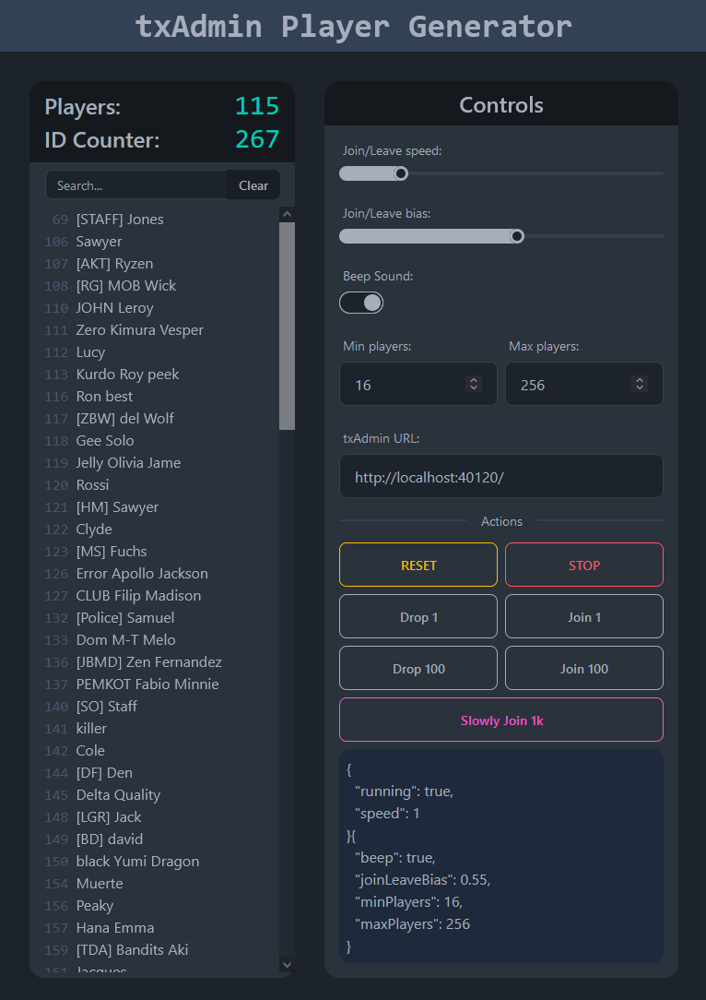

# txAdmin-playerGen

This project allows you to inject fake players in [txAdmin](https://github.com/tabarra/txAdmin) for purposes of testing stuff.  
It was created as a dev tool while migrating the txAdmin interface to React in the v7 update, and it is published as a separate package not to pollute the main repo.  
Try it out: https://txadmin-playergen-tabarra.vercel.app/  

  
## Notes
- To simulate the players, I did statistical analysis on all servers for the ideal size (max, median, quantile, etc) of player identifiers, name and HWIDs. As far as I can tell, HWIDs change with time. The ideal name length was dropped in favor of looking real and safe.
- To simulate realistic join/leave behavior, I used the exponential random PRNG (which looks like radioactive decay), which _lambda_ can be adjusted through a slider, as well as the join/leave bias.
- There is no error handling for failed API calls, but that doesn't really matter in this use case.
- Due to the item above, if the speed is at the max it is expected some small desync issues with txAdmin.
- I used this opportunity to test [DaisyUI](https://daisyui.com/), so the theme of course doesn't match txAdmin.
  
> **NOTE: Keep in mind this project only had 2~3 days of time budget so the code is a bit messy.**

## Future Work (TODO)
As needed during the txAdmin development, the changes below might be welcomed:
- Option to add/remove arbitrary players with arbitrary data.
- Option to actually Sync the txAdmin playerlist instead of just pushing events to it.

## License and Credits
- This project is licensed under the [MIT License](https://github.com/tabarra/txAdmin-playerGen/blob/master/LICENSE);
- The [beep sounds](https://freesound.org/people/unfa/packs/15012/) are from Freesound, licensed under [CC0](https://creativecommons.org/publicdomain/zero/1.0/);
- The favicon emoji is from [Twemoji](https://github.com/twitter/twemoji), licensed under [CC-BY 4.0](https://github.com/twitter/twemoji/blob/master/LICENSE-GRAPHICS).
